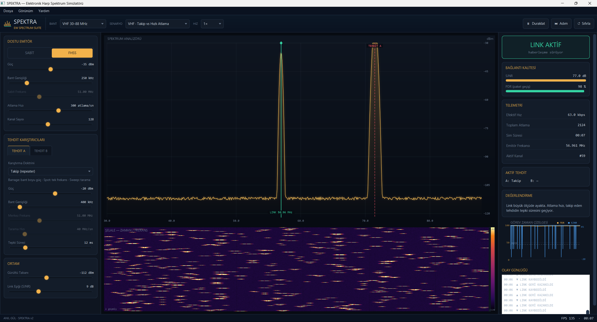

<div align="center">



<br/>

**Gerçek zamanlı RF spektrum analizörü + şelale diyagramı üzerinde, taktik bir haberleşme telsiğini frekans-atlamalı (FHSS) olarak düşman karıştırıcılara karşı çalıştıran bir elektronik harp simülasyon platformu.**


-F2B24B)


</div>

---

## Ne yapar

SPEKTRA, bir **dostu telsik** (sabit frekans veya **FHSS** — frekans atlamalı) ile bir veya iki
**düşman karıştırıcıyı** (barrage / spot / tarama / **takip**) RF düzeyinde karşı karşıya getirir.
Sinyal, gürültü ve karışma etkileşimi lineer güç düzleminde modellenir; link kalitesi **SJNR**
(Sinyal / Karışma+Gürültü) üzerinden değerlendirilir, paket teslim oranı (PDR) ve elektronik harp
metrikleri canlı üretilir.

İmza mekaniği: **takip eden (follower) karıştırıcının bir tepki gecikmesi vardır.** Telsik, jammer
yetişemeden bir sonraki frekansa atlarsa link ayakta kalır — bu, şelalede kırmızı jammer izinin amber
sinyal izini **bir adım geriden kovalaması** olarak görünür. Doktrin, modelden kendiliğinden çıkar.

<div align="center">
<em>Ekran görüntüsü — <code>docs/screenshot.png</code></em><br/>

</div>

---

## Öne çıkan özellikler

- **Dört bant ön ayarı** — VHF (30–88), UHF (225–400), L (960–1215), ISM 2.4 GHz.
- **İki eşzamanlı tehdit** — Tehdit A (kırmızı) ve Tehdit B (mor) aynı anda; PSD ve SJNR ikisinin katkısını birlikte hesaplar.
- **Hazır senaryolar** — Hızlı/Yavaş Atlama, Spot Tuzağı, Barrage Baskısı, Katmanlı Tehdit, ISM Sweep; tek tıkla yüklenir.
- **Canlı spektrum + şelale** — gerçek zamanlı PSD ve kayan spektrogram; spektrum üzerinde fare ile frekans/güç okuması.
- **Görev zaman çizelgesi + olay günlüğü** — kayan PDR/SJNR grafiği ve zaman damgalı olaylar (link kopması/geri gelmesi).
- **Senaryo kaydet/yükle** (`.spx`) ve **PNG dışa aktarma** (rapor/sunum için).
- **Simülasyon kontrolü** — 0.25×–4× hız, tek adım ilerletme, sıfırlama.
- **Menü + araç çubuğu + klavye kısayolları** — `Ctrl+S/O/E`, `Ctrl+P`, `Ctrl+R`, `F1`.

---

## Fizik gerçekten çalışıyor

Aşağıdaki değerler saf-Java simülasyon çekirdeği üzerinde sayısal olarak ölçülmüştür:

| Senaryo | Sonuç (PDR) |
|---|---:|
| Takip eden jammer → hızlı atlayan link | **~%98** — link jammer'ı geçer |
| Takip eden jammer → yavaş atlayan link | **~%31** — jammer yetişir |
| Spot jammer → aynı frekanstaki sabit link | **%0** — link çöker |
| Barrage → bant baskısı | **%0** — tüm bant boğulur |
| Katmanlı tehdit (A + B birlikte) | **~%93** — hızlı atlama iki tehdide de dayanır |
| ISM sweep → atlayan link | **~%97** — tarama savuşturulur |

Sağ paneldeki **Değerlendirme** satırı bu durumu sade dille yorumlar.

---

## Hızlı başlangıç (her platform — kod olarak)

Gereksinim: **JDK 21** + **Maven**.

```bash
mvn clean javafx:run
```

Bu komut JavaFX bağımlılıklarını otomatik indirir ve uygulamayı açar. Geliştirirken en hızlı yol budur.

> Arayüz **Bahnschrift** ve **Consolas** yazı tiplerini kullanır (Windows 10/11'de hazır gelir).
> Başka platformlarda sistem yedeğine düşer; hedef platform Windows olduğundan orada tasarlandığı gibi görünür.

---

## Windows kurulumu

Son kullanıcı için hazır kurulum dosyası **[Releases](../../releases)** sekmesindedir:

- **`SPEKTRA-2.0.0.msi`** — çift tıkla kur; Başlat menüsüne kısayol ekler, Denetim Masası'ndan kaldırılabilir.
  **Java kurulu olması gerekmez** — küçültülmüş Java + JavaFX çalışma zamanı kurulumun içine gömülüdür.

Kurulumu kaynaktan kendin üretmek istersen (JDK 21 + Maven + [WiX Toolset v3](https://github.com/wixtoolset/wix3/releases) gerekir):

```powershell
.\build-windows.ps1          # jlink ile özel çalışma zamanı + jpackage ile app-image
```

`.msi` üretmek için:

```powershell
mvn -q clean javafx:jlink
jpackage --type msi --name SPEKTRA --app-version 2.0.0 --runtime-image target\spektra-runtime --module com.anilgul.spektra/com.anilgul.spektra.App --dest dist --win-shortcut --win-menu --win-dir-chooser --vendor "Anil Gul"
```

---

## Kullanım

**Üst araç çubuğu:** Bant · Senaryo · Hız seçicileri, Duraklat / Adım / Sıfırla.
**Sol panel:** EMİTÖR (dostu telsik: SABİT/FHSS, güç, bant genişliği, atlama hızı/kanal sayısı) · TEHDİT A / TEHDİT B (iki karıştırıcı) · ORTAM (gürültü tabanı, SJNR eşiği).
**Sağ panel:** Bağlantı durumu, SJNR/PDR ölçerleri, telemetri, zaman çizelgesi, olay günlüğü.
**Menü:** Dosya (senaryo kaydet/yükle, PNG dışa aktar) · Görünüm (duraklat, adım, sıfırla) · Yardım.

**Denemesi keyifli:** Karıştırıcıyı **Takip (Follower)** yap, emitörü **FHSS**'e al. Atlama hızını düşür → link kopar (jammer yetişir); yükselt → link geri gelir. Şelalede kırmızının amberi bir adım geriden kovaladığını gör.

---

## Proje yapısı

```
spektra-ew/
├── pom.xml                 Maven (Java 21 + JavaFX 21)
├── build-windows.ps1       Windows paketleme (jlink + jpackage)
├── LICENSE                 MIT
└── src/main/
    ├── java/
    │   ├── module-info.java
    │   └── com/anilgul/spektra/
    │       ├── App.java             Uygulama + menü/araç çubuğu + 60 fps döngü
    │       ├── sim/                 Fizik çekirdeği (saf Java, JavaFX'ten bağımsız)
    │       │   ├── Band.java            Bant + ön ayarlar, frekans↔bin dönüşümü
    │       │   ├── Emitter.java         Dostu telsik (SABİT / FHSS)
    │       │   ├── Jammer.java          Karıştırıcı teknikleri
    │       │   ├── Scenario.java        Hazır senaryolar + .spx kaydet/yükle
    │       │   └── SimEngine.java       Alt-adımlı fizik, SJNR/PDR, olay kuyruğu
    │       └── ui/                  JavaFX görseller
    │           ├── SpectrumView · WaterfallView · ControlPanel
    │           ├── MetricsPanel · TimelineView · EventLogView
    │           └── Theme · AboutDialog
    └── resources/com/anilgul/spektra/spektra.css
```

Fizik çekirdeği (`sim/`) tamamen saf Java'dır; JavaFX olmadan derlenip test edilebilir.

---

## Teknoloji

Java 21 · JavaFX 21 (saf kod, FXML yok) · Canvas tabanlı gerçek zamanlı çizim · jlink + jpackage ile bağımsız Windows paketi.

---

## Dürüst not

Fizik çekirdeğini sayısal olarak doğruladım ve tüm kaynağın derleme bütünlüğünü (yazım, tip, dosyalar
arası çağrı tutarlılığı) denetledim. JavaFX/arayüz katmanı dikkatle yazıldı; bir derleme hatası görürsen
[issue](../../issues) aç, hızla düzeltilir.

---

## Lisans

[MIT](LICENSE) — © 2026 **Anıl Gül**

<div align="center">
<sub>SPEKTRA · Elektronik Harp Spektrum & Karıştırma Analiz Platformu · ANIL GÜL, 2026</sub>
</div>
